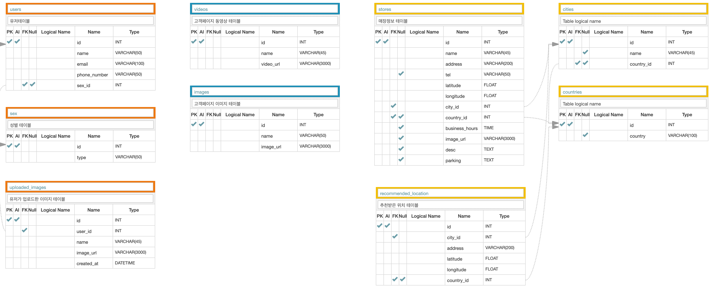

## Gopizza-CustomerPage_backend
## Introduction
- Gopizza 고객 홍보 사이트
- 구성: 프론트엔드 2명, 백엔드 2명
- 기간: 2020년 6월 22일 - 2020년 7월 5일

## Tech Stack Architecture
![](

## DB Modeling

## Technologies

- python
- Django Web  Framework
- MySQL
- AWS EC2, RDS, S3
- JWT, BCrypt
- Json
- CORS headers
- Git, Github

## Features

### User
 - BCrypt를 사용하여 유저 패스워드 암호화
 - JWT를 사용하여 유저 Token 생성
 - 사용자가 업로드한 이미지 S3에 저장
 
 ### Content
 - S3에 저장된 고피자 콘텐츠 이미지 및 비디오 렌더링
 
 ### Store
 - GeoDjnago를 사용하여 현재 내 위치로부터 가까운 매장 정렬 및 출력
 - 가까운 매장이 없을 시, Kakao API를 이용하여 신규 매장 위치 추천 기능 구현
 
 ### Deploy
 - AWS EC2를 사용하여 웹서비스 서버 배포 및 RDS 데이터베이스 구축

